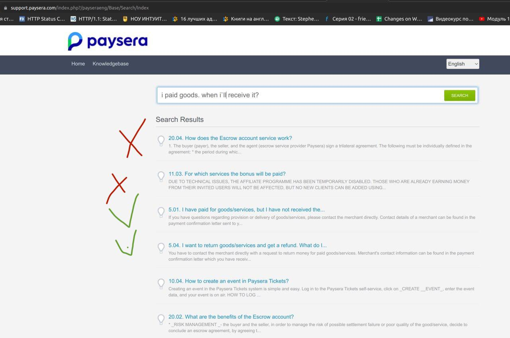
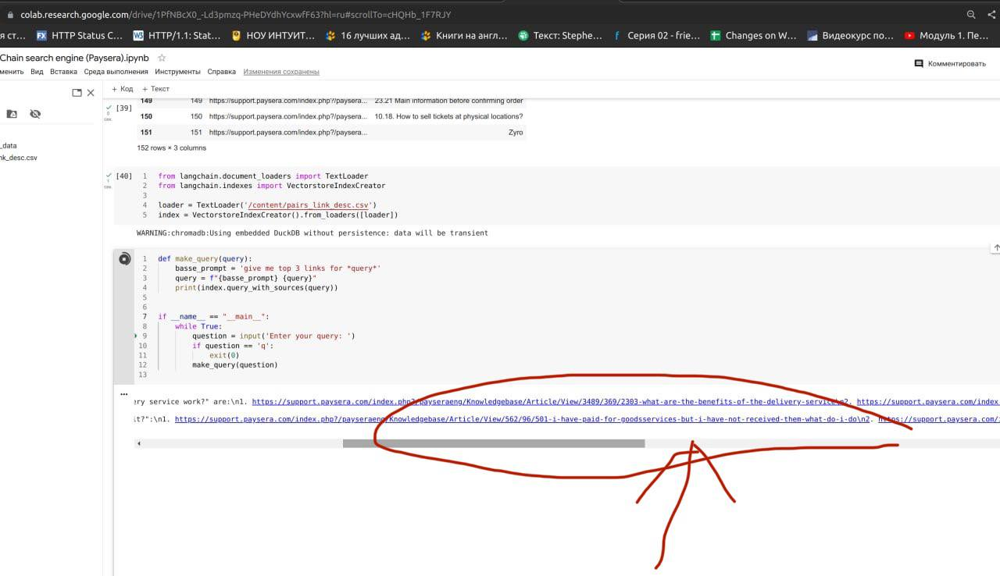
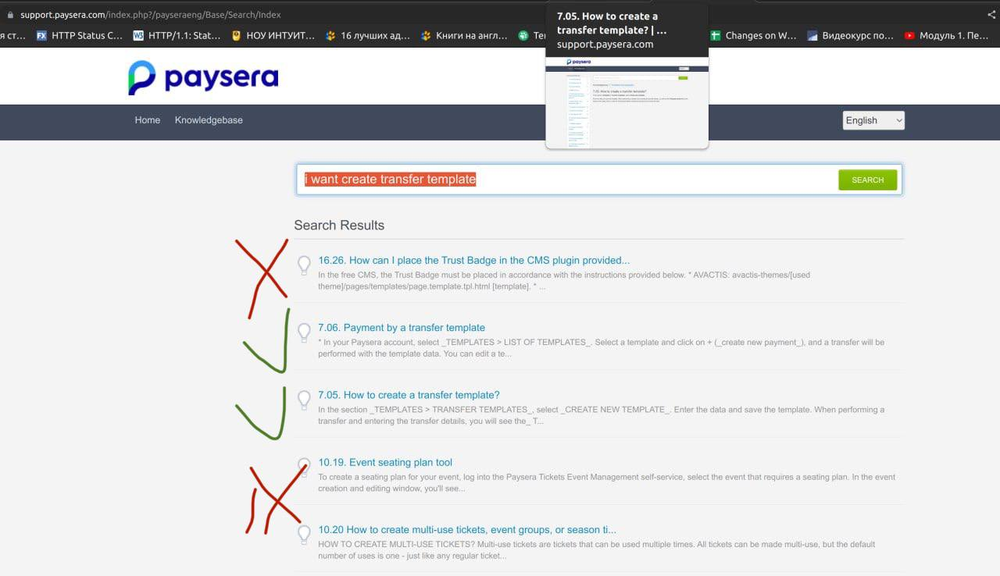
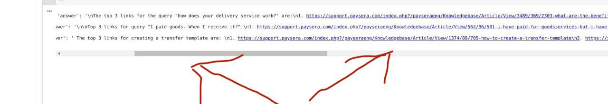
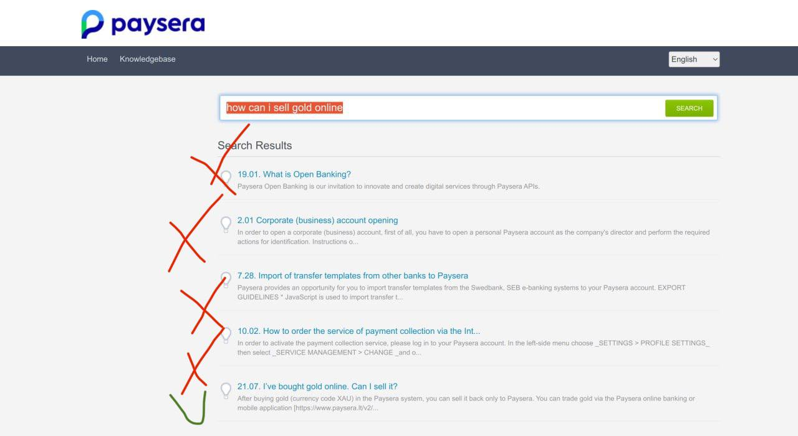
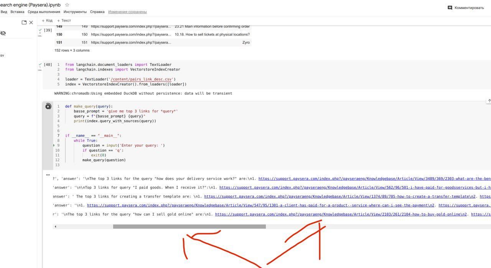

### LongChain QA (OpenAI API) for search engine improvement

For test purposes, I checked your support's search engine https://support.paysera.com/index.php?/payseraeng/Knowledgebase/List (manually)
The search takes a long time, there are also irrelevant answers (see below).

Since I do not have access to data, I decided to try to create a search engine using BeautifulSoup for parsing information and LangChain QA
for indexing and extract information.

* first image from support search engine
* second one - LongChain QA 
1.

2.

3.

